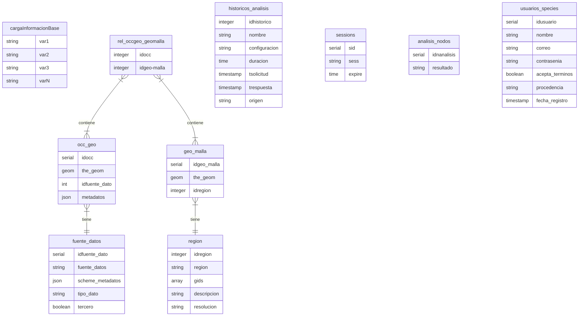

# species_v3.0

On this repository you will find the Beta version of SPECIES (Plataforma de exploración de datos ecológicos). On this Beta version, the team tries to explore a new database structure in order to facilitate and expand the type of data that can SPECIES worked with, seeking not only to accept biotic data but also data from different sources. 

The following ER Diagram is the first draft to explore and discuss main fields and relations amoung tables.

