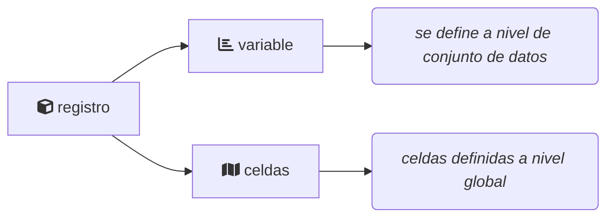

# Propuesta de arquitectura

## Servicios de fuentes de datos

Cada fuente de datos tendrá la responsabilidad de mantener sus datos e integrar
a los mismos información respecto a como se traducen a las mallas geográficas 
registradas en el catálogo central de mallas. Esto es, cada registro se le podrá
asociar un conjunto de celdas donde este tiene presencia.

Para cada conjunto de datos se puede definir una _variable_ como una medición 
de alguna característica de los registros. En cada fuente de datos se tendrán 
distintas variables definidas, e.g. en la fuente de datos SNIB, se puede pensar 
una especie como variable, en el caso de BIOCLIM sería un bucket; una variable 
asocia más de un registro del conjunto a una variable.



Además, se puede definir un conjunto de filtros que puedan ser usados para 
descartar registros del conjunto de datos para el análisis.

## Fuentes de datos utilizadas en SPECIES

El proyecto de SPECIES cuenta con tres fuentes de datos principales, mas otras
fuentes de datos secundarias. 

La fuentes principales integradas en este proyecto son: El Sistema Nacional de 
Información sobre Biodiversidad de México (SNIB), El Sistema Global de Información 
sobre Biodiversidad (GBIF, por sus siglas en inglés) y La Base de Datos Meteorólogicos 
y Climáticos Globales (Worldcim).


### Fuente de Datos SNIB

El SNIB alberga la información de las especies, y actualmente contiene entre otros, 
45,423,191 de registros de presencia de 114,684 especies, contenidas en sus catálogos 
taxonómicos; fichas técnicas de más de 3,100 especies nativas de México y de más 
de 1,280 especies exóticas. Se han integrado al SNIB, hasta agosto de 2022, los 
resultados de 1,071 proyectos que dieron origen a 1,212 bases de datos. El SNIB, fuera
del proyecto de SPECIES, contine información cartográfica con más de 18 mil mapas de 
distintos temas, principalmente de la distribución de las especies, así como la 
cobertura del suelo (vegetación y usos del suelo) del país en diferentes años; un 
acervo con más de 620 mil imágenes de sensores remotos y 155 mil fotografías e 
ilustraciones de especies, ecosistemas y usos en formato digital.


### Fuente de Datos GBIF

GBIF es una red internacional e infraestructura de datos financiada por los gobiernos 
del mundo para dar a cualquiera, en cualquier lugar, acceso abierto a datos sobre 
todas las formas de vida en la Tierra.

La red GBIF de países —que se estructuran como nodos— y organizaciones participantes, 
está coordinada a través de su Secretaría en Copenhague y proporciona a las instituciones 
proveedoras de datos de todo el mundo estándares comunes y herramientas de código 
abierto que les permiten compartir información sobre dónde y cuándo se han registrado las 
especies. Este conocimiento procede de diversas fuentes, que incluyen desde especímenes 
de museos recogidos en los siglos XVIII y XIX hasta fotografías de teléfonos inteligentes 
geoetiquetadas y compartidas por naturalistas aficionados en los últimos días y semanas.


La red de GBIF organiza todas esas fuentes mediante el uso del estándar Darwin Core, 
que constituye la base del índice GBIF.org de cientos de millones de registros de especies. 
Los proveedores ofrecen acceso abierto a sus juegos de datos eligiendo del listado de 
distintos tipos de licencias Creative Commons, lo que permite a los científicos, 
investigadores y otros usuarios aplicar o usar los datos cada año en cientos de publicaciones 
revisadas por colegas o para documentos de política.

La Secretaría de GBIF prepara un programa de trabajo anual dentro de un marco estratégico de 
cinco años que recibe la revisión y aprobación de la Junta de Gobierno de GBIF.


### Fuente de Datos WorldClim

WorldClim es una base de datos de datos meteorológicos y climáticos globales de alta resolución 
espacial. Estos datos se pueden utilizar para mapeo y modelado espacial. Los datos se 
proporcionan para su uso en investigaciones y actividades relacionadas.

La versión 2.1 para 1970-2000 de los datos climáticos de WorldClim versión 2.1 fue liberada en 
enero de 2020.

Hay datos climáticos mensuales de temperatura mínima, media y máxima, precipitación, radiación 
solar, velocidad del viento, presión de vapor de agua y precipitación total. También hay 19 
variables “bioclimáticas”.

Los datos están disponibles en las cuatro resoluciones espaciales, entre 30 segundos (~1 km2) 
y 10 minutos (~340 km2). Cada descarga es un archivo “zip” que contiene 12 archivos GeoTiff (.tif), 
uno para cada mes del año.


### Propuesta de endpoints

**GET** `/variables`

Obtener el listado de variables definidas en la fuente de datos 

Regresa

| Campo           | Tipo       | Descripción                                    |
|-----------------|------------|------------------------------------------------|
| id              | id         | Identificador de la variable                   |
| name            | string     | Nombre de la variable                          |
| level_size      | int        | Número de niveles que toma la variable         |
| filter_fields   | array[str] | Campos que acepta la variable para filtrar     |
| available_grids | array[str] | Listado de mallas disponibles para la variable |

**GET** `/variables/:id:`

Obetener el listado de niveles de la variable con id `:id:`

Parámetros

| Parámetro | Tipo | Descripción                                     | Default value |
|-----------|------|-------------------------------------------------|---------------|
| q         | str  | Patrón para filtrar los niveles de la variable  | *             |
| offset    | int  | Número de registros en la búsqueda para escapar | null          |
| limit     | int  | Número de máximo de niveles en la respuesta     | 10            |

Regresa

Un arreglo `json` de tamaño `limit` con las propiedades listadas para cada registro 

| Campo    | Tipo | Descripción                                    |
|----------|------|------------------------------------------------|
| id       | id   | Identificador de la variable                   |
| level_id | id   | Identificador del nivel de valor de la varible |
| data     | json | Información sobre el nivel de la variable      |

**GET** `/get-data/:id:`

Obtener los valores de los niveles solicitados de la variable con id `:id:`

Parámetros

| Parámetro     | Tipo                    | Descripción                                                     |
|---------------|-------------------------|-----------------------------------------------------------------|
| grid_id       | id                      | Identificador de la malla a usar                                |
| levels_id     | array[id]               | Lista separada por comas de los ids de nivel que se quiere usar |
| filter_names  | array[str]              | Lista separada por comas de filtros para aplicar                |
| filter_values | array[str\|value\|bool] | Lista de valores para usar en los filtros                       |

Regresa

Un arreglo `json` con registro con las siguientes propiedades

| Campo    | Tipo       | Descripción                                                     |
|----------|------------|-----------------------------------------------------------------|
| id       | id         | Identificador de la variable                                    |
| grid_id  | id         | Identificador de la malla a usar                                |
| level_id | id         | Identificador del nivel de valor de la varible                  |
| cells    | array[int] | Lista de celdas de la malla donde toma el nivel la variable     |
| n        | int        | Número de celdas ocupadas por el nivel del valor de la variable |

## Servicio de procesamiento de _ensambles_

Este es un servicio común para poder construir ensambles de modelos a partir de 
la conexión a diferentes fuentes de datos. Entre sus funciones tiene la 
obligación de 
  
  - Exponer las diferentes mallas en donde se puede hacer el análisis
  - Exponer los listados de variables con las que se pueden construir ensambles
  - Calcular los valores de _score_ y épsilon para el ensamble


### Esquemas de datos 

Esta es una propuesta de creación de esquemas de datos para poder manejar la 
definición de ensamables de modelos y que puedan ser procesados por este 
servicio.

#### Tipo filtro

```json
{
    "$id": "URI/filter-schema.json",
    "$schema": "https://json-schema.org/draft/2020-12/schema",
    "title": "Filter",
    "description": "A container that holds information about how to narrow down a set of data",
    "type": "object",
    "properties": {
        "name": {
            "description": "Name of the filter",
            "type": "string"
        },
        "value": {
            "description": "Specifies the values data should have to be included based on this filter"
            "type": "string"
        }
    }
}
```

#### Tipo estado variable

```json
{
    "$id": "URI/variable-state.json",
    "$schema": "https://json-schema.org/draft/2020-12/schema",
    "title": "Variable state",
    "description": "Value that holds a variable",
    "properties": {
        "variableId": {
            "description": "variable id for the dataset",
            "type": "string"
        },
        "datasetId": {
            "description": "dataset id",
            "type": "string"
        },
        "levelId": {
            "description": "value that hold the varibles selected",
            "type": "string"
        }
        "filters": {
            "description": "a list of filter for the variable",
            "type": "array",
            "items": {
                "$ref": "URI/filter-schema.json",
            }
        }
    }
}
```

#### Tipo ensamble

```json
{
    "$id": "URI/ensamble.json",
    "$schema": "https://json-schema.org/draft/2020-12/schema",
    "title": "Ensamble",
    "description": "Experiment ensamble to explore relations",
    "type": "object",
    "properties": {
        "target": {
            "description": "A list of target variable states",
            "type": "array",
            "items": {
                "$ref": "URI/variable-state.json"
  
            }
        },
        "covariables": {
            "description": "A list of covariables states",
            "type": "array",
            "items": {
                "$ref": "URI/variable-state.json"
  
            }
        },
        "grid-id": {
            "description": "Grid to use for the experiment ensamble",
            "type": "string"
        },
        "precision": {
            "type": "float"
        }
    }
}
```
### Propuesta de endpoints

**GET** `/region-grids`

Obtiene el listado de mallas disponibles

Parámetros

| Parámetro | Tipo | Descripción                 | Default value |
|-----------|------|-----------------------------|---------------|
| q         | str  | Query para filtrar regiones | *             |

Regresa

Un arreglo `json` con registro con las siguientes propiedades

| Campo  | Tipo | Descripción                                        |
|--------|------|----------------------------------------------------|
| id     | id   | Identificador de la malla                          |
| region | str  | Nombre de la región donde la malla está disponible |
| grid   | str  | Resolución o tipo de división de la malla          |


**GET** `/region-grids/:id:`

Regresa un geojson de la malla con identificador `:id:`

**GET** `/datasets`

Regresa el listado de conjuntos de datos disponibles en el servicio

Regresa

Un arreglo `json` con registro con las siguientes propiedades

| Campo | Tipo | Descripción                         |
|-------|------|-------------------------------------|
| id    | id   | Identificador de la fuente de datos |
| name  | str  | Nombre de la fuente de datos        |

**GET** `/datasets/:id:`

URL base para acceder a los _endpoints_ de la fuente de datos con id `:id:` 

TODO: @José Luis creo que esto es el servicio que presentaste. Tal vez se puede
completar según el desarrollo presentado.

