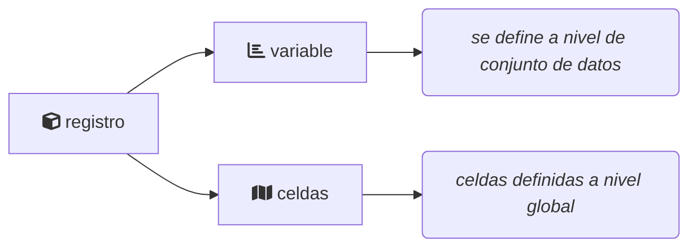

# Propuesta de arquitectura

## Servicios de fuentes de datos

Cada fuentes de datos tendrá la responsabilidad de mantener sus datos e integrar
a los mismos información respecto a como se traducen a las mallas geográficas 
registradas en el catálogo central de mallas. Esto es cada registro se le podrá
asociar un conjunto de celdas donde este tiene presencia.

Para cada conjunto de datos se puede definir una _variable_ como una medición 
de alguna característica de los registros. En cada fuente de datos se tendrá 
distintas variable definidas, e.g. en la fuente de datos SNIB se puede pensar 
una especie como variable, en el caso de BIOCLIM sería un bucket; una variable 
asocia más de un registro del conjunto a una variable.

Además se puede definir un conjunto de filtros que puedan ser usados para 
descartar registros del conjunto de datos para el análisis.

### Propuesta de endpoints

**GET** `/variables`

Obtener el listado de variables definidas en la fuente de datos 

Regresa

| Campo         | Tipo   | Descripción                                |
|---------------|--------|--------------------------------------------|
| id            | id     | Identificador de la variable               |
| name          | string | Nombre de la variable                      |
| level_size    | int    | Número de niveles que toma la variable     |
| filter_fields | json   | Campos que acepta la variable para filtrar |

**GET** `/variables/:id:`

Obetener el listado de niveles de la variable con id `:id:`

Parámetros

| Parámetro | Tipo | Descripción                                    | Default value |
|-----------|------|------------------------------------------------|---------------|
| q         | str  | Patrón para filtrar los niveles de la variable | *             |
| offset    | json | Valor de la variable                           | null          |
| limit     | json | Campos que acepta la variable para filtrar     | 10            |

Regresa

Un arreglo `json` de tamaño `limit` con las propiedades listadas para cada registro 

| Campo    | Tipo | Descripción                                    |
|----------|------|------------------------------------------------|
| id       | id   | Identificador de la variable                   |
| level_id | id   | Identificador del nivel de valor de la varible |
| data     | json | Información sobre el nivel de la variable      |

**GET** `/get_data/:id:`

Obtener los valores de los niveles solicitados de la variable con id `:id:`

Parámetros

| Parámetro     | Tipo                    | Descripción                                                     |
|---------------|-------------------------|-----------------------------------------------------------------|
| grid_id       | id                      | Identificador de la malla a usar                                |
| levels_id     | array[id]               | Lista separada por comas de los ids de nivel que se quiere usar |
| filter_names  | array[str]              | Lista separada por comas de filtros para aplicar                |
| filter_values | array[str\|value\|bool] | Lista de valores para usar en los filtros                       |

Regresa

Un arreglo `json` con registro con las siguientes propiedades

| Campo    | Tipo       | Descripción                                                     |
|----------|------------|-----------------------------------------------------------------|
| id       | id         | Identificador de la variable                                    |
| grid_id  | id         | Identificador de la malla a usar                                |
| level_id | id         | Identificador del nivel de valor de la varible                  |
| cells    | array[int] | Lista de celdas de la malla donde toma el nivel la variable     |
| n        | int        | Número de celdas ocupadas por el nivel del valor de la variable |

## Servicio de procesamiento de _ensambles_

Este es un servicio común para poder construir ensambles de modelos a partir de 
la conexión a diferentes fuentes de datos. Entre sus funciones tiene la 
obligación de 
  
  - Exponer las diferentes mallas en donde se puede hacer el análisis
  - Exponer los listados de variables con las que se pueden construir ensambles
  - Calcular los valores de _score_ y épsilon para el ensamble

### Propuesta de endpoints

**GET** `/datasets`

Regresa el listado de conjuntos de datos disponibles en el servicio

Regresa

Un arreglo `json` con registro con las siguientes propiedades

| Campo | Tipo | Descripción                         |
|-------|------|-------------------------------------|
| id    | id   | Identificador de la fuente de datos |
| name  | str  | Nombre de la fuente de datos        |

**GET** `/datasets/:id:`

URL base para acceder a los _endpoints_ de la fuente de datos con id `:id:` 

TODO: @José Luis creo que esto es el servicio que presentaste. Tal vez se puede
completar según el desarrollo presentado.

