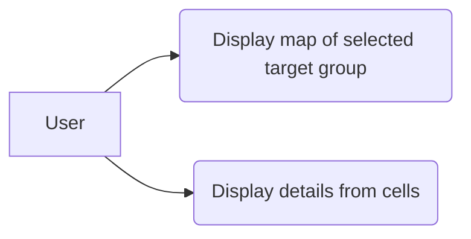

# Use case: Display Target Group

The user will be able to view a map of the selected target group. Data will be display base on resolution and geographic area selected. The user will be able to get details from the elements within each cell of the generated map.

