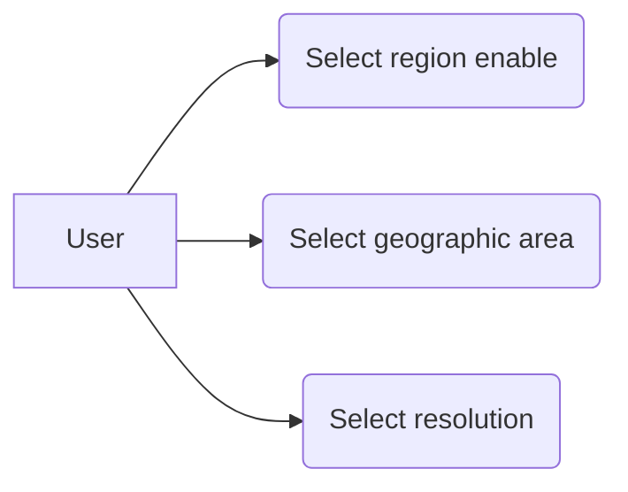

# Use case: Region and Resolution Selection

The user will be able to select a region or geographic area from a list of available resources base on the data source selected previously. The user will be able to select from a list the resolution considered to count correlations between the target group and the covariates.

