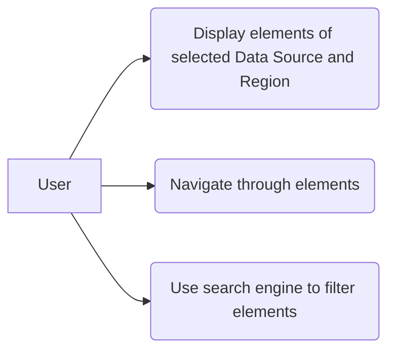

# Use case: Target Group Selection

The user will be able to select elements for a target group through a user interface that displays sorted elements that are part from the data source. As well as a search engine of elements to facilitate the user needs. The data can be filtered by a range of dates, undated records or other additional field.

